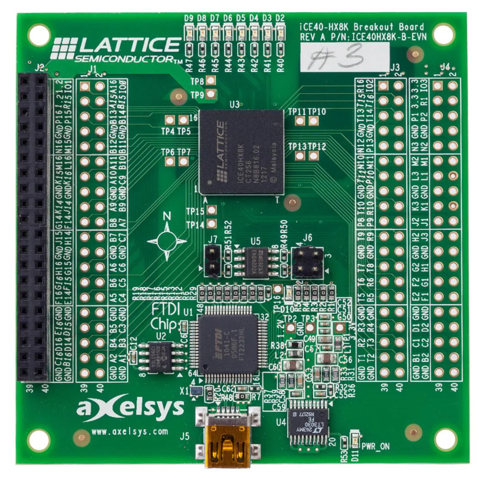
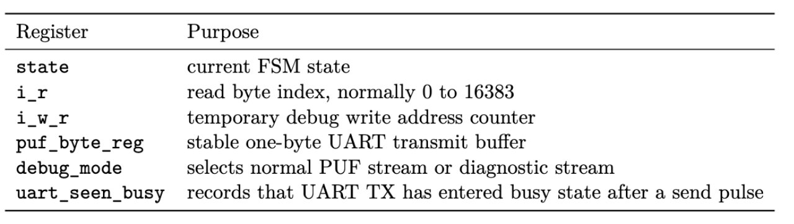
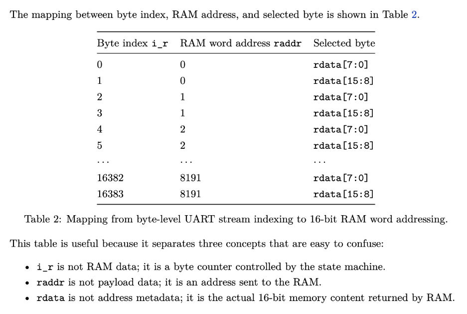
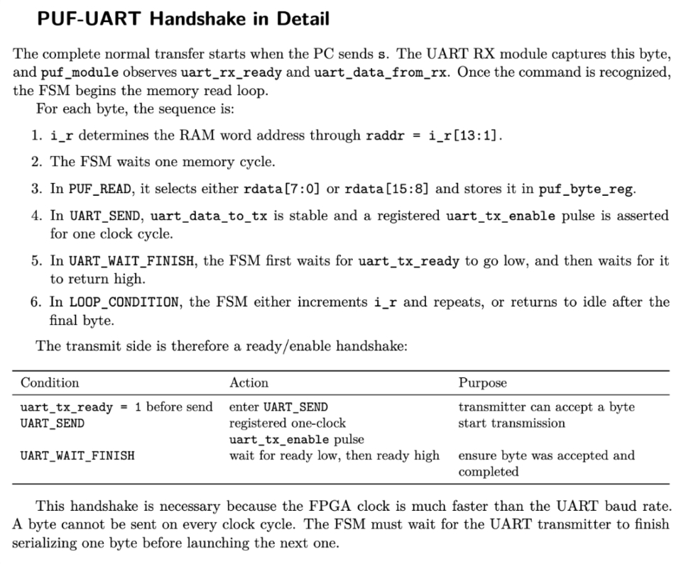
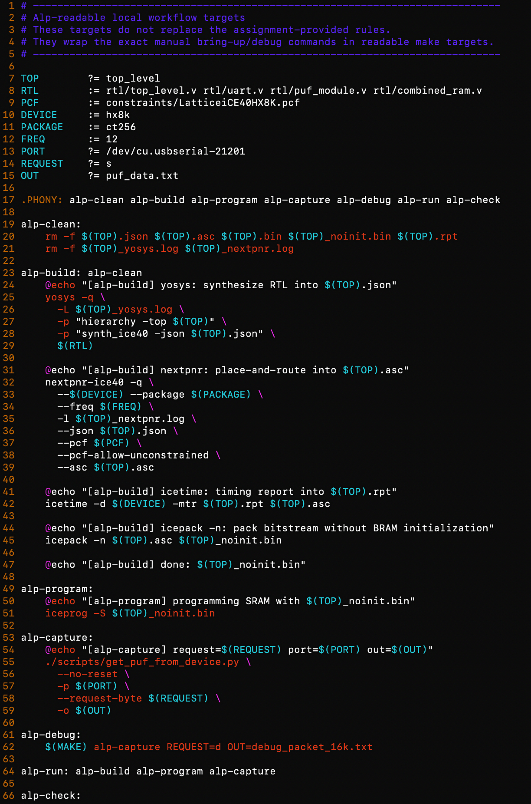
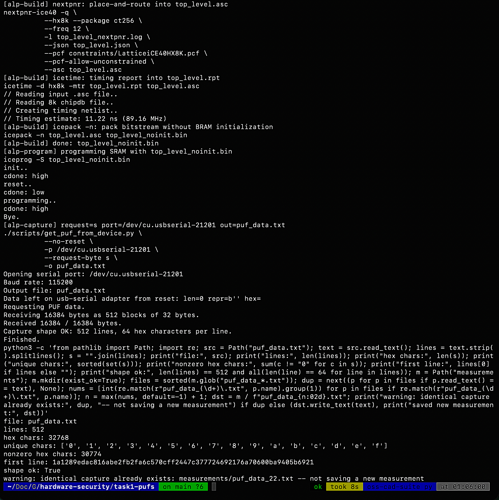
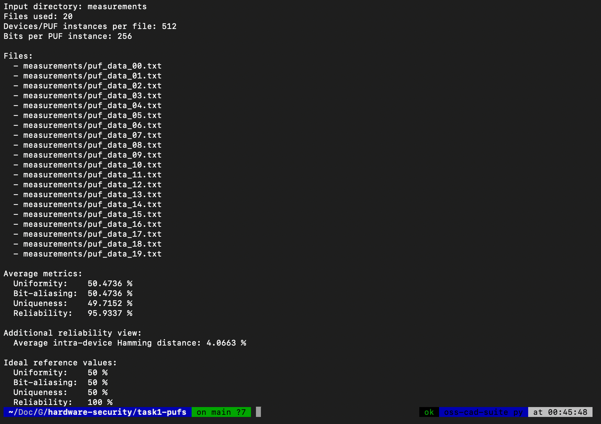

# Task 1: SRAM PUF readout on Lattice iCE40-HX8K

This directory contains my implementation, measurement workflow, and analysis for **Task 1: SRAM PUFs** in the hardware security assignment.

The goal of the task is to read the power-up state of the FPGA SRAM/BRAM, transmit it to the PC over UART, collect multiple readouts after power cycles, and evaluate the resulting PUF data statistically.

<p align="center">
  
</p>

The board used in this task is the **Lattice iCE40-HX8K breakout board**. The relevant memory is exposed through the provided `combined_ram.v` wrapper, while `puf_module.v` implements the controller that reads the RAM and sends the data to the PC over UART.

---

## Table of contents

- [What this task implements](#what-this-task-implements)
- [Repository structure](#repository-structure)
- [High-level architecture](#high-level-architecture)
- [Important files](#important-files)
  - [RTL files](#rtl-files)
  - [Python scripts](#python-scripts)
  - [Measurements](#measurements)
  - [Analysis files](#analysis-files)
  - [Documentation and assets](#documentation-and-assets)
- [Data model](#data-model)
- [PUF module design](#puf-module-design)
  - [Persistent registers](#persistent-registers)
  - [Byte index to RAM address mapping](#byte-index-to-ram-address-mapping)
  - [PUF-UART handshake](#puf-uart-handshake)
- [Build and run workflow](#build-and-run-workflow)
  - [Environment](#environment)
  - [Readable Makefile targets](#readable-makefile-targets)
  - [Normal capture flow](#normal-capture-flow)
  - [Debug capture flow](#debug-capture-flow)
- [Measurement procedure](#measurement-procedure)
- [PUF analysis](#puf-analysis)
  - [Metrics computed](#metrics-computed)
  - [Current average results](#current-average-results)
  - [How to rerun the analysis](#how-to-rerun-the-analysis)
- [Debugging notes and final fixes](#debugging-notes-and-final-fixes)
- [Submission notes](#submission-notes)
- [Glossary](#glossary)

---

## What this task implements

The assignment asks us to:

1. complete the TODOs in `rtl/puf_module.v`,
2. make UART communication work,
3. connect the SRAM/BRAM readout path,
4. transmit the complete SRAM PUF data to the PC,
5. pack the bitstream with BRAM initialization disabled,
6. collect multiple readouts after power cycles,
7. compute PUF statistics:
   - [Uniformity](#uniformity),
   - [Bit-aliasing](#bit-aliasing),
   - [Uniqueness](#uniqueness),
   - [Reliability](#reliability).

The working implementation now:

- builds the FPGA bitstream with `icepack -n`, so BRAM initialization is skipped;
- reads 16 KiB from the provided RAM wrapper;
- sends the data over UART as 16384 bytes;
- saves the data as 512 lines of 64 hexadecimal characters;
- stores repeated measurements under `measurements/`;
- analyzes the measurements under `analysis/`.

---

## Repository structure

Current relevant directory layout:

```text
.
├── Makefile
├── README.md
├── analysis
│   ├── analyze_puf.py
│   ├── results_detailed.csv
│   └── results_summary.txt
├── assets
│   ├── alp-makefile.jpg
│   ├── build.jpg
│   ├── byte_index_to_raddr.jpg
│   ├── lattice_iCE40HX8K.jpg
│   ├── measurements.jpg
│   ├── puf_uart_handshake.jpg
│   └── registers.jpg
├── constraints
│   └── LatticeiCE40HX8K.pcf
├── docs
│   ├── Task-1-PUFs.pdf
│   ├── task1_puf_aciklama.pdf
│   └── task1_puf_explanation_en.pdf
├── measurements
│   ├── puf_data_00.txt
│   ├── ...
│   └── puf_data_22.txt
├── notes
│   ├── TODO.txt
│   ├── puf_data_example1.txt
│   ├── puf_data_example2.txt
│   └── *.tex
├── rtl
│   ├── combined_ram.v
│   ├── puf_module.v
│   ├── top_level.v
│   └── uart.v
└── scripts
    ├── get_puf_from_device.py
    └── puf_data.txt
```

Some generated files such as `top_level.asc`, `top_level.json`, `top_level_noinit.bin`, and log files may also exist after building. They are build artifacts, not source files.

---

## High-level architecture

At a high level, the system consists of:

```text
PC Python script  <---- UART ---->  uart.v  <---->  puf_module.v  <---->  combined_ram.v / BRAM
```

The PC sends a one-byte command over UART. The FPGA receives the command, starts a finite-state machine in `puf_module.v`, reads the RAM contents, and transmits the bytes back to the PC.

The most important normal request byte is:

```text
s or S  -> start normal PUF readout
```

A temporary diagnostic request also exists:

```text
d or D  -> start debug/diagnostic stream
```

The normal readout sends:

```text
16384 bytes = 16 KiB
```

The Python script writes this as:

```text
512 lines × 64 hex characters per line
```

Each line is one simulated 256-bit PUF instance.

---

## Important files

### RTL files

#### `rtl/top_level.v`

`top_level.v` connects the board-level signals, UART module, and PUF module. It is the synthesis top module used by the Makefile flow:

```make
TOP ?= top_level
```

The build flow uses:

```bash
yosys -p "hierarchy -top top_level" ...
```

#### `rtl/uart.v`

`uart.v` handles the low-level UART RX/TX serialization. For the PUF controller, the important abstraction is:

- `uart_rx_ready` means a command byte from the PC is available;
- `uart_data_from_rx` contains that byte;
- `uart_tx_ready` means the transmitter can accept a new byte;
- `uart_data_to_tx` is the byte to transmit;
- `uart_tx_enable` is the send pulse.

The PUF module does not need to know the UART bit-level implementation. It only needs to respect the ready/enable handshake.

#### `rtl/puf_module.v`

This is the main file completed for the task.

It implements:

- request handling for `s/S` and temporary debug `d/D`;
- SRAM/BRAM read addressing;
- 16-bit RAM word to 8-bit UART byte conversion;
- UART transmit handshake;
- a registered one-clock `uart_tx_enable` pulse;
- `uart_seen_busy`, which makes sure the UART actually enters busy state before the FSM accepts a later ready-high as completion.

The most important final fix is that `uart_tx_enable` is **not** driven as a combinational state output anymore. It is generated as a registered one-clock pulse in the sequential FSM. This avoids repeated transmission of the same byte.

#### `rtl/combined_ram.v`

`combined_ram.v` is the provided wrapper around the physical Lattice RAM primitives. It exposes a larger logical memory space to `puf_module.v`.

From the perspective of `puf_module.v`, this behaves like:

```text
8192 words × 16 bits = 131072 bits = 16384 bytes = 16 KiB
```

Internally, the wrapper maps the 13-bit address into 32 physical `SB_RAM40_4K` blocks:

```text
raddr[12:8] -> RAM block index
raddr[7:0]  -> local word address inside the selected block
```

The final implementation works with the original `combined_ram.v`; no functional change to the provided RAM wrapper is required.

---

### Python scripts

#### `scripts/get_puf_from_device.py`

This script communicates with the FPGA over USB serial.

It does the following:

1. opens the selected serial port;
2. optionally flushes leftover data;
3. sends the request byte, usually `s`;
4. reads exactly 16384 bytes;
5. writes the capture as 512 lines of 64 hex characters;
6. validates the output shape.

The script was also adjusted to work reliably on my MacBook setup. In particular, it helps with detecting/selecting the correct USB-serial port on macOS and sends the request byte from the PC to the FPGA before capturing the PUF response.

Typical manual usage:

```bash
./scripts/get_puf_from_device.py \
  --no-reset \
  -p /dev/cu.usbserial-21201 \
  --request-byte s \
  -o puf_data.txt
```

For diagnostic mode:

```bash
./scripts/get_puf_from_device.py \
  --no-reset \
  -p /dev/cu.usbserial-21201 \
  --request-byte d \
  -o debug_packet_16k.txt
```

---

### Measurements

The collected PUF measurements are stored under:

```text
measurements/
```

The files are named:

```text
puf_data_00.txt
puf_data_01.txt
...
puf_data_19.txt
```

Additional captures may also exist, such as `puf_data_20.txt`, `puf_data_21.txt`, or `puf_data_22.txt`, as backups or repeated validation captures.

Each file contains:

```text
512 lines
64 hex characters per line
256 bits per line
```

Each file corresponds to one capture after programming / power-cycling the board. The same line number across different files corresponds to the same simulated PUF instance across different power cycles.

---

### Analysis files

#### `analysis/analyze_puf.py`

This script reads the measurement files and computes the requested PUF metrics:

- [Uniformity](#uniformity),
- [Bit-aliasing](#bit-aliasing),
- [Uniqueness](#uniqueness),
- [Reliability](#reliability).

The script works on individual bits, not just bytes.

#### `analysis/results_summary.txt`

This is the human-readable summary of the current analysis run.

#### `analysis/results_detailed.csv`

This contains detailed metric data. It can be large, especially for uniqueness, because uniqueness involves pairwise comparisons between many simulated PUF instances.

---

### Documentation and assets

#### `docs/`

The `docs/` directory contains:

- the original task PDF;
- generated explanation PDFs;
- supporting documentation.

#### `notes/`

The `notes/` directory contains working notes, LaTeX sources, and example PUF data files.

#### `assets/`

The `assets/` directory contains images used in this README and explanation documents.

---

## Data model

The assignment treats the SRAM/BRAM contents as many smaller PUF instances.

The full readout is:

```text
16 KiB = 16384 bytes = 131072 bits
```

This is divided into:

```text
512 PUF instances × 256 bits each
```

In file form:

```text
1 line = 64 hex characters = 256 bits = one PUF instance
512 lines = complete 16 KiB readout
```

Across repeated measurements:

```text
same line number across files = same simulated PUF instance across power cycles
```

This is why the analysis script compares:

- different lines within one file for inter-device properties;
- the same line across multiple files for reliability.

---

## PUF module design

### Persistent registers

The important state and data registers are summarized below:

<p align="center">
  
</p>

The central registers are:

- `state`: current FSM state;
- `i_r`: read byte index;
- `i_w_r`: temporary debug write address counter;
- `puf_byte_reg`: stable byte buffer for UART TX;
- `debug_mode`: selects normal PUF stream or diagnostic stream;
- `uart_seen_busy`: records that UART TX entered busy state after a send pulse.

The final design also clears and updates `uart_tx_enable` inside the sequential FSM, so that it is a registered one-clock pulse.

---

### Byte index to RAM address mapping

The RAM returns 16-bit words, but UART sends 8-bit bytes. Therefore, one RAM word is transmitted as two UART bytes.

The byte index `i_r` is not the same thing as the RAM word address. Instead:

```verilog
raddr = i_r[13:1];
```

and:

```text
i_r[0] = 0 -> select rdata[7:0]
i_r[0] = 1 -> select rdata[15:8]
```

<p align="center">
  
</p>

This mapping is one of the most important parts of the design:

- `i_r` is a byte counter controlled by the FSM;
- `raddr` is the word address sent to RAM;
- `rdata` is the actual 16-bit memory content returned by RAM.

---

### PUF-UART handshake

The normal transfer starts when the PC sends `s` over UART. The UART RX module captures this byte, and `puf_module.v` starts the memory read loop.

For each byte:

1. `i_r` determines the RAM word address through `raddr = i_r[13:1]`;
2. the FSM waits one memory cycle;
3. in `PUF_READ`, it selects either `rdata[7:0]` or `rdata[15:8]`;
4. the selected byte is stored in `puf_byte_reg`;
5. in `UART_SEND`, a registered one-clock `uart_tx_enable` pulse is asserted;
6. in `UART_WAIT_FINISH`, the FSM first waits for `uart_tx_ready` to go low, then waits for it to return high;
7. in `LOOP_CONDITION`, the FSM either increments `i_r` or returns to idle.

<p align="center">
  
</p>

This handshake is necessary because the FPGA clock is much faster than the UART baud rate. The design must not attempt to send one byte every FPGA clock cycle; it must wait for the UART transmitter to finish serializing the current byte.

---

## Build and run workflow

### Environment

The flow uses the iCE40 open-source FPGA toolchain:

- `yosys` for synthesis;
- `nextpnr-ice40` for place and route;
- `icetime` for timing estimation;
- `icepack` for bitstream packing;
- `iceprog` for programming.

The critical bitstream packing detail is:

```bash
icepack -n top_level.asc top_level_noinit.bin
```

The `-n` option skips BRAM initialization. This is required because the PUF depends on the SRAM/BRAM power-up state. If BRAM is initialized to zero by the bitstream, the PUF measurement is destroyed.

---

### Readable Makefile targets

The raw `yosys`, `nextpnr`, `icetime`, `icepack`, and `iceprog` commands are long and error-prone. For local bring-up, I added readable wrapper targets to the Makefile.

<p align="center">
  
</p>

The main commands are:

```bash
make alp-clean
make alp-build
make alp-program
make alp-capture OUT=puf_data.txt
make alp-check OUT=puf_data.txt
```

The combined flow is:

```bash
make alp-run OUT=puf_data.txt
make alp-check OUT=puf_data.txt
```

The debug flow is:

```bash
make alp-run REQUEST=d OUT=debug_packet_16k.txt
```

or, if the board is already programmed with a debug-capable bitstream:

```bash
make alp-debug
```

Important note: `make alp-debug` only performs the capture step. It does not rebuild or reprogram the FPGA. If the currently programmed bitstream does not contain the debug request handler, `make alp-debug` may receive zero bytes.

---

### Normal capture flow

A normal build and capture run looks like this:

<p align="center">
  
</p>

The command sequence is:

```bash
make alp-clean
make alp-build
make alp-program
make alp-capture OUT=puf_data.txt
make alp-check OUT=puf_data.txt
```

`make alp-check` validates the captured file and stores it under `measurements/` if it is new.

It checks:

- number of lines;
- number of hex characters;
- set of observed hex characters;
- number of non-zero hex characters;
- whether the shape is valid;
- whether the same capture already exists.

If the exact same capture already exists, it prints a warning such as:

```text
warning: identical capture already exists: measurements/puf_data_22.txt -- not saving a new measurement
```

In that case, the board should be unplugged, a few seconds should be waited, and the flow should be repeated after plugging the board back in.

---

### Debug capture flow

The diagnostic mode is useful for checking the UART/FSM path. It is triggered with request byte `d`:

```bash
make alp-run REQUEST=d OUT=debug_packet_16k.txt
```

The expected diagnostic stream starts with the marker:

```text
44 42
```

which corresponds to ASCII:

```text
D B
```

During debugging, a faulty transmit-enable implementation produced:

```text
44 44 42 42
```

This showed that the same byte was being transmitted twice. The fix was to make `uart_tx_enable` a registered one-clock pulse and to use `uart_seen_busy` in `UART_WAIT_FINISH`.

---

## Measurement procedure

The final measurement procedure is:

1. build the bitstream with `icepack -n`;
2. program the FPGA SRAM;
3. capture one PUF data file;
4. run `make alp-check OUT=puf_data.txt`;
5. unplug the board;
6. wait a few seconds;
7. plug it back in;
8. repeat until at least 20 valid captures are stored under `measurements/`.

The reason for unplugging is that the PUF depends on the power-up state of SRAM/BRAM. A simple rerun without a real power cycle may reproduce the same memory state or a stale debug pattern.

---

## PUF analysis

### Metrics computed

The analysis script computes the following metrics.

#### Uniformity

Uniformity measures the fraction of ones inside a PUF response. For a 256-bit response, ideal uniformity is 50%.

In this project, uniformity is computed for every PUF instance in every capture and then averaged.

#### Bit-aliasing

Bit-aliasing measures whether a specific bit position tends to be 0 or 1 across different PUF instances. The ideal value is also 50%.

In this project, bit-aliasing is computed across the 512 simulated PUF instances for each bit position.

#### Uniqueness

Uniqueness measures how different two PUF instances are. It is computed as the normalized inter-device Hamming distance. The ideal value is 50%.

In this project, different lines in the same capture are treated as different simulated devices.

#### Reliability

Reliability measures how stable the same PUF instance is across repeated power cycles. It is computed from intra-device Hamming distance across repeated captures.

The ideal reliability is 100%.

---

### Current average results

The current analysis summary is shown below:

<p align="center">
  
</p>

The current average metrics over 20 captures are:

| Metric | Result | Ideal value | Interpretation |
|---|---:|---:|---|
| Uniformity | 50.4736% | 50% | close to ideal |
| Bit-aliasing | 50.4736% | 50% | close to ideal |
| Uniqueness | 49.7152% | 50% | close to ideal |
| Reliability | 95.9337% | 100% | good, but raw SRAM PUF has unstable bits |

The average intra-device Hamming distance is:

```text
4.0663%
```

For a 256-bit PUF instance, this corresponds to roughly:

```text
256 × 0.040663 ≈ 10.4 unstable bits on average
```

This is reasonable for raw SRAM PUF data. In a practical deployment, unstable-bit filtering or error correction would be needed.

---

### How to rerun the analysis

Run:

```bash
./analysis/analyze_puf.py \
  --input measurements \
  --max-files 20 \
  --out-dir analysis
```

This produces:

```text
analysis/results_summary.txt
analysis/results_detailed.csv
```

The summary file is intended for quick inspection. The detailed CSV contains per-metric details and may be large.

---

## Debugging notes and final fixes

Several issues were encountered during bring-up.

### 1. Full zero captures

At first, captures returned all zeros. This made it unclear whether the problem was in:

- Python serial reading;
- UART request handling;
- FSM state transitions;
- RAM readout;
- BRAM initialization.

The Python script was made more verbose and the serial port handling was checked. The correct macOS serial port was `/dev/cu.usbserial-21201` in my setup.

### 2. Diagnostic mode

A diagnostic `d/D` request was added. This mode returned known marker bytes and selected internal signal values. The marker `44 42` was especially useful because it proved that the FSM entered debug mode and that non-zero bytes could be sent over UART.

### 3. Repeated bytes

The first useful diagnostic stream showed:

```text
44 44 42 42
```

instead of:

```text
44 42
```

Since these bytes are constants, the duplication could not be caused by RAM data. It showed a UART transmit handshake problem.

### 4. Registered `uart_tx_enable`

The fix was to generate `uart_tx_enable` as a registered one-clock pulse in the sequential FSM instead of as a combinational state output.

Additionally, `UART_WAIT_FINISH` was changed to wait for:

```text
ready high before send
ready low after send
ready high after completion
```

This is tracked using `uart_seen_busy`.

### 5. A5A5 writeback test

A temporary writeback test wrote `16'hA5A5` into RAM while idle. Reading back `A5A5` proved that the RAM path and UART path were alive.

For the final PUF capture, this was disabled:

```verilog
localparam DEBUG_TEST_WRITEBACK = 1'b0;
```

After disabling writeback and power-cycling the board, the design produced non-constant PUF data.

### 6. Original `combined_ram.v`

The final design was also tested with the original `combined_ram.v`. The PUF data could still be generated correctly. Therefore, the functional fix was in `puf_module.v`, not in the provided RAM wrapper.

---

## Submission notes

Important files for review:

```text
rtl/puf_module.v
Makefile
scripts/get_puf_from_device.py
measurements/puf_data_00.txt ... puf_data_19.txt
analysis/analyze_puf.py
analysis/results_summary.txt
```

The final implementation keeps:

```verilog
localparam DEBUG_TEST_WRITEBACK = 1'b0;
```

This keeps the RAM read-only during normal PUF capture.

For normal capture:

```bash
make alp-run OUT=puf_data.txt
make alp-check OUT=puf_data.txt
```

For analysis:

```bash
./analysis/analyze_puf.py --input measurements --max-files 20 --out-dir analysis
```

---

## Glossary

### `i_r`

The byte-level read index used by the FSM. It counts transmitted UART bytes, not RAM words.

### `raddr`

The 13-bit RAM word address. It is derived from `i_r[13:1]`.

### `rdata`

The 16-bit RAM word returned by `combined_ram.v`.

### `puf_byte_reg`

A stable 8-bit buffer between RAM readout and UART transmission.

### `uart_tx_enable`

A registered one-clock pulse telling the UART transmitter to accept the byte on `uart_data_to_tx`.

### `uart_tx_ready`

A UART transmitter status signal. The FSM waits for it before sending and waits for it to go low and high again after sending.

### `uart_seen_busy`

A flag used in `UART_WAIT_FINISH` to confirm that the UART transmitter actually entered busy state after a send pulse.

### `DEBUG_TEST_WRITEBACK`

A local parameter used only during debugging. It must be `0` for real PUF capture.

### `icepack -n`

The bitstream packing option that skips BRAM initialization. This is necessary for reading SRAM/BRAM power-up contents as a PUF.