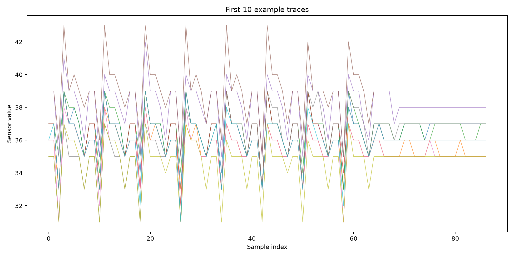
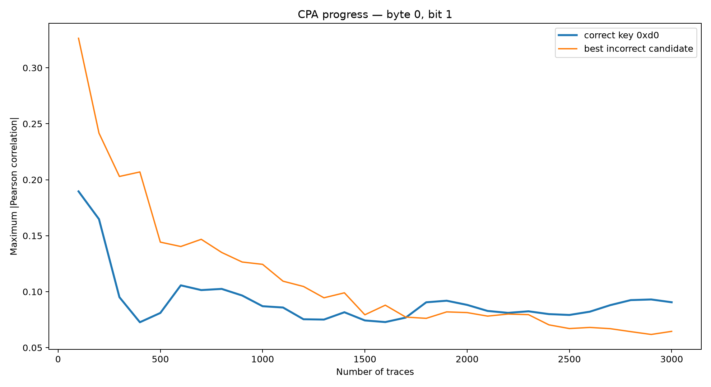
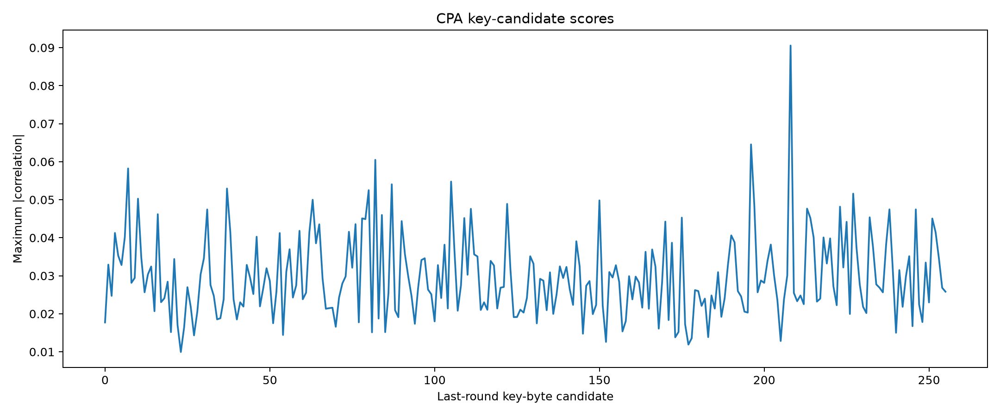
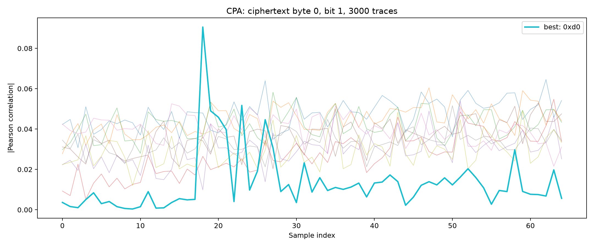

# AES Correlation Power Analysis on FPGA

This directory contains the FPGA implementation, trace-acquisition software, and hardware-side CPA evaluation for Task 3.

The design executes AES-128 on a Lattice iCE40HX8K FPGA and samples a delay-based on-chip sensor during the final encryption round. The collected traces are analyzed with a ciphertext-based correlation power analysis model to identify key-dependent leakage.

## What this project demonstrates

AES remains cryptographically secure, but its hardware implementation can still leak information through data-dependent physical behavior.

The attack implemented here does not recover the key by breaking AES mathematically. Instead, it:

1. executes many encryptions with known inputs,
2. records sensor traces during the final AES round,
3. predicts internal values for every round-key hypothesis,
4. correlates those predictions with the measured traces,
5. identifies hypotheses that produce statistically distinguishable leakage.

The target intermediate value is:

```text
InvSBox(C XOR K)
```

where:

- `C` is one ciphertext byte,
- `K` is one candidate byte of the AES round-10 key.

Each output bit is evaluated independently using Pearson correlation.

## Reference-trace validation

Before collecting FPGA measurements, the CPA implementation was validated using the example traces supplied with the task.

The reference dataset consists of:

- one AES key and plaintext pair per trace,
- the corresponding sensor trace,
- reconstructed ciphertexts used by the final-round model.

A representative subset of the traces is shown below.



For ciphertext byte 0 and inverse S-box output bit 1, the correct round-10 key-byte candidate is:

```text
0xd0
```

The correct hypothesis becomes distinguishable after approximately 2000 traces.



The final candidate scores show the correct key-byte hypothesis separating from the incorrect candidates.



The sample-wise correlation curves are shown below.



These results validate the ciphertext interpretation, inverse S-box model, bit extraction, and correlation implementation before applying the same method to physical FPGA measurements.

## Hardware architecture

The FPGA design contains:

- an AES-128 encryption core,
- a delay-based sensor,
- BRAM for trace storage,
- UART communication with the host.

`sense_module.v` captures 56 consecutive sensor samples during the final AES round. The final-round indication is synchronized into the sensor clock domain and used to start a bounded BRAM write sequence.

After each encryption, the FPGA returns:

1. the 16-byte ciphertext,
2. the 56-byte sensor trace.

The measurement path was verified to return the correct ciphertext and exactly 56 non-saturated sensor values per transaction.

## Main hardware files

- `top_level.v` — top-level FPGA integration
- `sense_module.v` — capture control and BRAM write logic
- `latticesense.v` — delay-based sensor implementation
- `clkgen48.v` — sensor clock generation
- `uart.v` — UART interface
- `decoder.v` — UART command decoding
- `aes/` — AES-128 RTL implementation
- `LatticeiCE40HX8K.pcf` — FPGA pin constraints
- `Makefile` — synthesis, place-and-route, bitstream generation, and programming support

## Host-side software

### `queryCipherSense.py`

Runs a single known-answer test and reads one sensor trace.

The serial device is configured statically in the script:

```python
DEV_UART = "/dev/..."
```

Update this path to match the UART device assigned by the host operating system.

### `collect_traces.py`

Sends random 16-byte plaintexts to the FPGA and records:

- the fixed AES key and plaintext,
- the returned ciphertext,
- the 56-byte sensor trace.

The collector produces:

```text
collected_msgs.csv
collected_ciphertexts.csv
collected_traces.csv
```

### `cpa_board_3000.py`

Runs an initial CPA over a small FPGA dataset to validate the acquisition and analysis pipeline.

### `cpa_board_100k.py`

Runs the final CPA over 100,000 FPGA traces and generates one correlation plot for every ciphertext-byte and output-bit combination.

The complete search covers:

```text
16 bytes × 8 bits = 128 CPA evaluations
```

## FPGA bring-up

### 1. Create a Python environment

```bash
python3 -m venv .venv
source .venv/bin/activate
python -m pip install numpy matplotlib pyserial tqdm pycryptodome
```

### 2. Build the FPGA design

```bash
make
```

The build produces:

```text
top_level.bin
```

### 3. Program the FPGA

```bash
iceprog top_level.bin
```

### 4. Configure the UART device

Update `DEV_UART` in the host scripts to match the serial device assigned to the board.

The design uses:

```text
1,000,000 baud
8 data bits
no parity
1 stop bit
```

### 5. Run the known-answer test

```bash
python queryCipherSense.py
```

The test uses the AES example from NIST FIPS 197:

```text
Plaintext:  3243f6a8885a308d313198a2e0370734
Ciphertext: 3925841d02dc09fbdc118597196a0b32
```

### 6. Collect traces

```bash
python collect_traces.py -n 100000 -o measurements_100k
```

### 7. Run CPA

```bash
python cpa_board_100k.py
```

## FPGA CPA result

A total of 100,000 hardware traces were collected.

The expected AES round-10 key was:

```text
abc1d22842e631c999631f6db7805e94
```

For byte 0 and inverse S-box output bit 4, the correct round-key candidate `0xab` produced the strongest absolute correlation:

```text
Key candidate: 0xab
Correlation:   0.021510
Sample:        8
Trace count:   100000
```

The remaining bit hypotheses did not produce stable first-ranked recovery.

This is consistent with the low signal-to-noise ratio of an on-chip delay sensor. Only a subset of the modeled intermediate values is expected to couple strongly enough into the selected sensor and capture window to become distinguishable.

The successful byte-0 result confirms that the complete chain—from RTL capture through UART acquisition to statistical analysis—detects key-dependent leakage from the physical FPGA implementation.

## Notes on interpretation

The recovered value is a byte of the AES round-10 key, not a byte of the original encryption key.

This experiment illustrates the distinction between algorithmic security and implementation security. AES itself remains secure, while a hardware implementation without side-channel countermeasures may reveal information through power, timing, electromagnetic, or sensor-based leakage.

## References

- NIST, *FIPS PUB 197: Advanced Encryption Standard (AES)*.
- Task 3 specification: Correlation Power Analysis using FPGA sensor traces.
